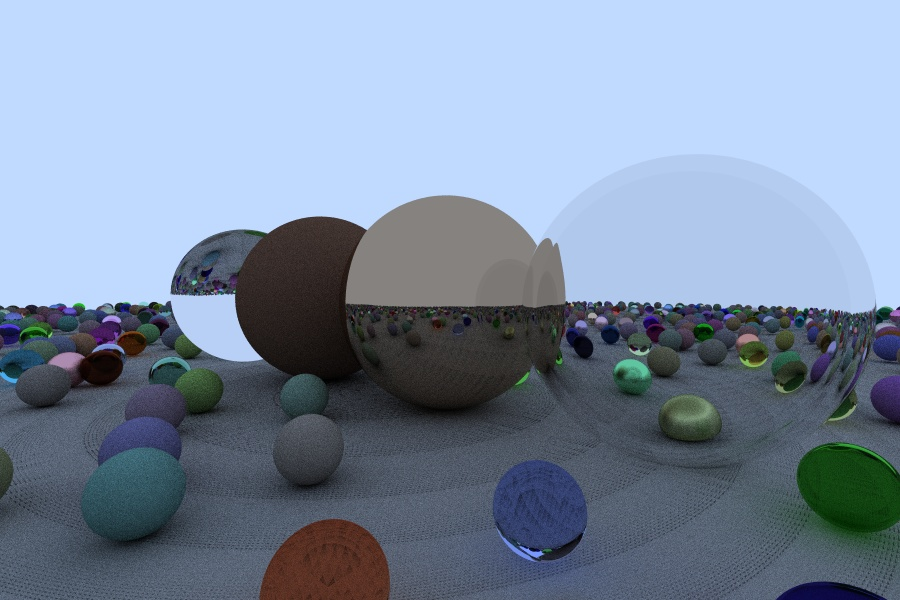

# A simple rederer

A simple rederer only use Opencv

## Output:  

* Phong Shading(Phong)
  
* Texture Mapping(Phong)
  
* Bump Mapping(Phong)
  
* Path Tracing
  
## Reference:

* Games101 -Lingqi Yan

* Real-Time Rendering (3rd edition)

* [ssloy/tinyrenderer](https://github.com/ssloy/tinyrenderer.git)
* [Ray Tracing](https://raytracing.github.io/)
